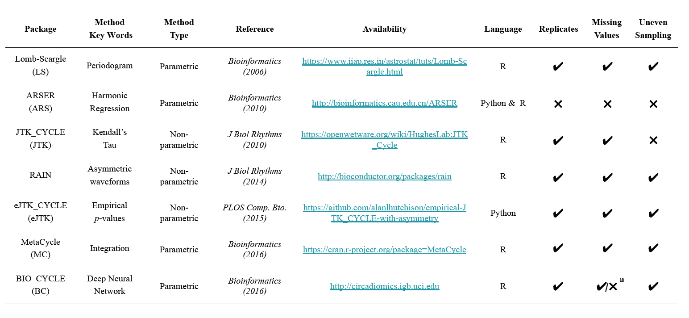
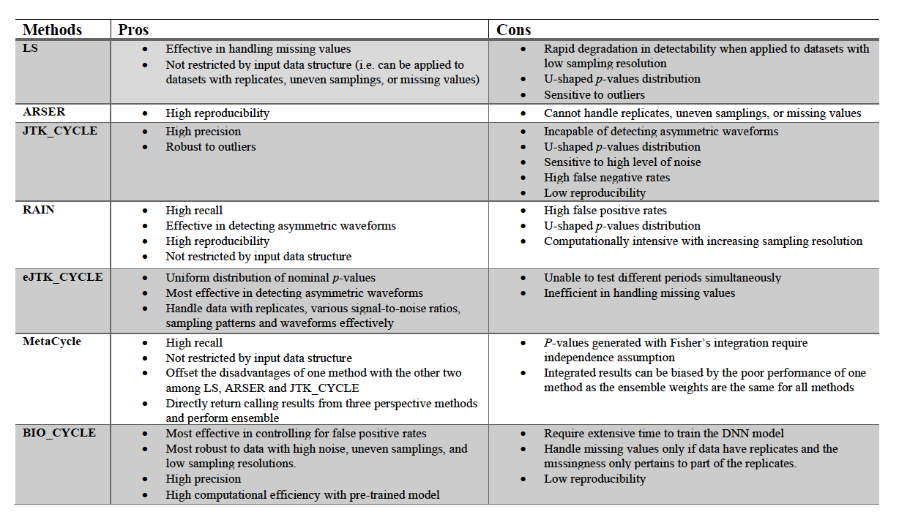
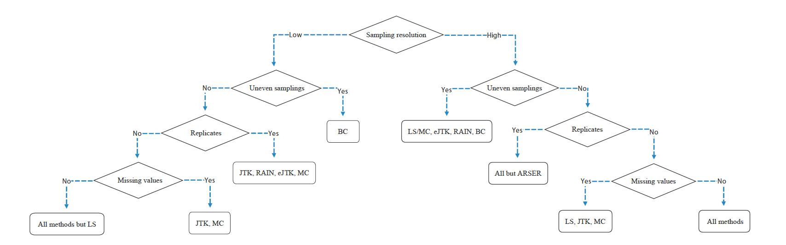

<center> <h4>Abstract</h4> </center>  

Circadian rhythm is an approximately 24 hour oscillation of biological processes that exists in organisms, including humans. Over the last two decades, various algorithms have been developed to detect these circadian rhythm. Here, we present the usage of seven algorthims, including Lomb Scargle, ARSER, JTK_CYCLE, RAIN, eJTK_CYCLE, MetaCycle, and BIO_CYCLE. 


## An example of empirical dataset 
Here we show an example of empirical dataset, Down-sampled Hughes 2009, that we use to assess the performance of seven algorithms. This dataset consists of 12,506 transcriptomes, sampled with the frequency of 2 hours/2 days. Below shows the expression values of some transcriptomes of the dataset. 
```{r data input, echo=FALSE}
ds_hughes2009 <- read.csv("../data/ds_hughes2009.csv", stringsAsFactors = F)
head(ds_hughes2009)[,-1]
```


## Methods Introduction and Application  

### [Lomb Scargle](https://academic.oup.com/bioinformatics/article/22/3/310/220284) (LS)
LS is an algorithm adopted from the field of astrophysics that detects oscillations using sinusoidal fits method.It is one of the earlier developed algorithms that can effectively deal with missing values by treating them as uneven sampling points. 

### [ARSER](https://github.com/cauyrd/ARSER) (ARS)
ARS is an algorithm that applies autoregressive spectral estimation to predict the periodic length of the time-series, and uses harmonic regression model (sinusoidal fits) to fit circadian rhythms and predict its parameters such as period, phase, amplitude, etc. 

### [JTK_CYCLE](https://openwetware.org/wiki/HughesLab:JTK_Cycle) (JTK)
JTK is a non-parametric, sinusoidal fits model that identifies oscillations by computing Kendall’s tau correlation between the time series and the specified reference sinusoidal curves. 

### [MetaCycle](https://github.com/gangwug/MetaCycle) (MC)
MetaCycle is an integrated R-package of LS, ARS, and JTK. It enables users to select one or multiple methods to evaluate periodicity. 

Below is an example of R code for individual analysis with LS and its result.
```{r ls, eval=F}
library(MetaCycle)
meta2d(infile = '../data/ds_hughes2009_meta.csv', outputFile = T,  filestyle = 'csv',
         timepoints = seq(18,64,2), cycMethod="LS", outIntegration = 'noIntegration', maxper = 28, minper = 20, outdir = '../data')
```
```{r, echo=F}
ls <- read.csv('../data/LSresult_ds_hughes2009_meta.csv')
head(ls)
```

Change `cycMethod= "LS"` to `cycMethod= "ARS"` or `cycMethod= "JTK"` for individual analysis with ARS or JTK. 

Below is an example of integrated MetaCycle analysis with all three algorithms.
```{r metacycle, eval=F}
library(MetaCycle)
meta2d(infile = '../data/ds_hughes2009_meta.csv', outputFile = T,  filestyle = 'csv',
         timepoints = seq(18,64,2), outIntegration = 'onlyIntegration', maxper = 28, minper = 20, outdir = '../data')
```
```{r, echo=F}
meta_ds_hughes2009 <- read.csv('../data/meta2d_ds_hughes2009.csv')
head(meta_ds_hughes2009)
```

### [RAIN](https://www.bioconductor.org/packages/release/bioc/html/rain.html)
RAIN builds on the strengths of JTK and improves its detectability with an additional set of asymmetric waveforms.  
`peak.border` can specify the different form of the peak.  
`nr.series` can specify the number of replicates.  
`measure.sequence` (not shown) can be used to specify the uneven sampling.  
$q$-values are calculated with `qvalue()` in `R package qvalue`.  
For datasets with replicates, please make sure you change nr.series= 2 and your input data format is all replicates for each time-point are placed next to each other (for example: CT0_1, CT0_2, CT2_1, CT2_2, CT3_1, CT3_2,...)


Below shows an example of RAIN execution code and its output. 
```{r rain, eval=F}
library(rain)
library(qvalue)
rain_ds_hughes2009 <- rain(t(ds_hughes2009[,-1]), deltat = 2, period = 24, period.delta = 4,
                                          peak.border = c(0.3, 0.7), nr.series = 1, adjp.method = "ABH")
rain_ds_hughes2009$qvalue <- qvalue(rain_ds_hughes2009$pVal)$qvalue
```

```{r,echo= FALSE}
# write.csv(rain_ds_hughes2009, '../data/rain_ds_hughes2009.csv')
rain_ds_hughes2009 <- read.csv('../data/rain_ds_hughes2009.csv')
head(rain_ds_hughes2009)
```

### [eJTK_CYCLE](https://github.com/alanlhutchison/empirical-JTK_CYCLE-with-asymmetry) (eJTK)
eJTK can not only effectively dectect asymmetric waveforms, but also takes a step further to correct the initial p-values with empirical p-values calculated from permutation.   
`-w` specifies the waveform to be compared, it is cosine as default;   
`-p` specifies the period, 24, because eJTK can only detect one single period per time.  
`-s` and `-a` specify phases and different form of the peak, respectively;   
`-x` specifies the suffix of output file;   
`-f` speficies the directory of input file.  

Note:  `GammaP` will vary when running the same code on the same dataset repeatedly.
eJTK_CYCLE handles missing values by separate a dataset into multiple datasets with similar missing value patterns (uneven time-point dataset), and then put the datasets back together. 

Below shows an example of eJTK execution code and its output. 
```{bash, eval=FALSE}
./eJTK/bin/eJTK-CalcP.py -w ./eJTK/ref_files/waveform_cosine.txt -p ./eJTK/ref_files/period24_1.txt -s ./eJTK/ref_files/phases_00-22_by2.txt -a ./eJTK/ref_files/asymmetries_02-22_by2.txt -x cos24_ph0-22_by2_a02-22_by2_OTHERTEXT -f ../data/ds_hughes2009.txt
```

```{r, echo=F}
ejtk_ds_hughes2009 <- read.table('../data/ds_hughes2009_cos24_ph0-22_by2_a02-22_by2_OTHERTEXT_jtkout_GammaP.txt', header = T)
head(ejtk_ds_hughes2009)
```

### [BIO_CYCLE](http://circadiomics.igb.uci.edu/biocycle) (BC)
BIO_CYCLE is a deep neural network (DNN) method trained from both simulated and empirical circadian and noncircadian time-series.  
`-i` specifies the input file (.tsv);  
`-s` specifies the starting (minimal) period;  
`-e` specifies ending (maximum) period;  
`-o` specifies the output directory in which the result file (.tsv) will be saved.  

Below shows an example of BC execution code and its output. 
```{bash, eval=FALSE}
Rscript ./BioCycle/BioCycle.R -i ../data/ds_hughes2009.tsv -s 20 -e 28 -o ../data/
```

```{r, echo=F}
bc_ds_hughes2009 <- read.table('../data/bc_ds_hughes2009.tsv', header = T)
head(bc_ds_hughes2009)
```

## Method Summary and Method Selection   

### Method Summary   



  
### Pros and Cons of Each Method

  
### Method Selection for Datasets with Low or High Sampling Resolutions



## Evaluation Based on Benchmark Genes
We evaluate the performance of each method with four measures: receiver operating characteristic (ROC) curve, the area under the ROC curve (AUC), precision, and recall. 
These measurements are calculated with our benchmark genes, which consist of 104 true circadian genes and 113 non-circadian genes. 

### Benchmark Genes
Here are examples of circadian and non-circadian genes used for analysis. Only 68 true circadian and 81 non-circadian genes are matched with Down-sampled Hughes 2019. 
```{r, echo=F,message = FALSE}
library(tidyverse)
p_benchmark <- read.csv('../data/p.benchmark.csv', stringsAsFactors = F) %>% data.frame() 
n_benchmark <- read.csv('../data/n.benchmark.csv', stringsAsFactors = F)%>% data.frame()
names(p_benchmark)[2] <-"symbol"
names(n_benchmark)[2] <-"symbol"
p <- merge(p_benchmark, ds_hughes2009, by="symbol")
n <- merge(n_benchmark, ds_hughes2009, by="symbol")
genes <- cbind(p[c(1:20), 1], n[c(1:20), 1]) %>% data.frame()
names(genes) <- c("Circadian Genes", "Non-circadian Genes")
head(genes)
```

```{r, echo=F}
pq_all_methods <- data.frame(LS_p = meta_ds_hughes2009$LS_pvalue, 
                             LS_q = meta_ds_hughes2009$LS_BH.Q,
                             ARS_p = meta_ds_hughes2009$ARS_pvalue, 
                             ARS_q = meta_ds_hughes2009$ARS_BH.Q, 
                             JTK_p = meta_ds_hughes2009$JTK_pvalue,
                             JTK_q = meta_ds_hughes2009$JTK_BH.Q,
                             RAIN_p = rain_ds_hughes2009$pVal,
                             RAIN_q = rain_ds_hughes2009$qvalue,
                             eJTK_p = ejtk_ds_hughes2009$GammaP,
                             eJTK_q = ejtk_ds_hughes2009$GammaBH,
                             MC_p = meta_ds_hughes2009$meta2d_pvalue, 
                             MC_q = meta_ds_hughes2009$meta2d_BH.Q,
                             BC_p = bc_ds_hughes2009$P_VALUE, 
                             BC_q = bc_ds_hughes2009$Q_VALUE)

p_benchmark_id <- which(ds_hughes2009$symbol %in% p_benchmark$symbol)
n_benchmark_id <- which(ds_hughes2009$symbol %in% n_benchmark$symbol)
benchmark_id <- c(p_benchmark_id, n_benchmark_id)
pq_benchmark <- pq_all_methods[benchmark_id, ]

actual <- factor(c(rep('True',68), rep('False',81)), levels = c('True', 'False'))
```


### Plot ROC curves with AUC values
ROC curves and AUC values are computed as the joint measures of specificity and sensitivity to determine the methods’ strengths of classifying circadian and non-circadian transcriptomes. ROC curve with high AUC value suggests the method can effectively identify a large number of true circadian genes while controlling for a high false positive rate. 
```{r, fig.align="center", results='hide', message = F, echo=FALSE}

library(pROC)

par(pty = 's')
roc(response = actual, predictor = pq_benchmark$LS_p, plot = T, legacy.axes = T,
    col = '#377eb8', lwd = 2, xlab = '1-Specificity', ylab = 'Sensitivity', quiet = T, auc = T, main="ROC Curves of Methods") 
plot.roc(x = actual, predictor = pq_benchmark$ARS_p, col = '#4daf4a',
         lwd = 2, add = T)
plot.roc(x = actual, predictor = pq_benchmark$JTK_p, col = '#8856a7',
         lwd = 2, add = T)
plot.roc(x = actual, predictor = pq_benchmark$RAIN_p, col = 'pink',
         lwd = 2, add = T)
plot.roc(x = actual, predictor = pq_benchmark$eJTK_p, col = '#feb24c',
         lwd = 2, add = T)
plot.roc(x = actual, predictor = pq_benchmark$MC_p, col = "red",
         lwd = 2, add = T)
plot.roc(x = actual, predictor = pq_benchmark$BC_p, col = '#0317fc',
         lwd = 2, add = T)

legend(x = 0.50, y = 0.40, legend=c('LS(0.8362)', 'ARS(0.8351)', 'JTK(0.8538)', 'RAIN(0.8371)', 'eJTK(0.8449)', 'MC(0.8462)', 'BC(0.8869)'), col=c('#377eb8', '#4daf4a', '#8856a7', 'pink', '#feb24c', 'red', '#0317fc'), lwd = 2, pt.cex = 1.0, cex = 1, y.intersp = 0.7, bty = 'n')


```


### Precision and Recall

Precision and recall rates are calculated to characterize the accuracy of each algorithm in terms of detection of circadian transcriptomes. The formulas for calculating $precision$ and $recall$ are shown below. 

$$precision=\frac{TP}{TP+FP}$$
$$recall=\frac{TP}{TP+FN}$$

```{r, echo=FALSE}
predicted <- ifelse(pq_benchmark$ARS_q < 0.05, 'True', 'False')
predicted <- factor(predicted, levels = c('True', 'False'))
```

```{r plot precision and recall, message=F, echo=FALSE}
get_prec_rec <- function(method, cutoff) {
  library(caret)
  predicted <- factor(ifelse(pq_benchmark[,method] < cutoff, 'True', 'False'),levels = c('True', 'False'))
  recall <- recall(data = predicted, reference = actual)
  precision <- precision(data = predicted, reference = actual)
  results <- data.frame(method = rep(sub("_[pq]", "", method),2), threshold = rep(cutoff,2), measure = c('Precision', 'Recall'), value = c(precision, recall))
  return(results)
}
```


We use $p$-value thresholds of 0.000005, 0.00005, 0.0005, and $q$-value threshold of 0.05 to calculate the precision and recall rates for all methods. 
```{r, message=F,echo=F}
df_pre_rec <- data.frame(method = NULL, threshold = NULL, measure = NULL, value = NULL)

threshold_p <- c(0.000005, 0.00005, 0.0005)
method_p <- c('LS_p', 'ARS_p', 'JTK_p', 'RAIN_p', 'eJTK_p', 'MC_p', 'BC_p')

for (i in threshold_p){
  for (j in method_p){
    df_pre_rec <- rbind(df_pre_rec, get_prec_rec(method = j, cutoff = i))
  }
}

method_q <- c('LS_q', 'ARS_q', 'JTK_q', 'RAIN_q', 'eJTK_q', 'MC_q', 'BC_q')

for (j in method_q){
    df_pre_rec <- rbind(df_pre_rec, get_prec_rec(method = j, cutoff = 0.05))
}
  
df_pre_rec$threshold <- as.factor(df_pre_rec$threshold)
```

Below is a table of the calculated precision and recall rates for each method. 
```{r, echo=FALSE}
df_pre_rec1 <- spread(df_pre_rec, measure, value)
head(df_pre_rec1, n=28)
```

Here is a visual representation of the comparisons among the methods. 
```{r, message=F, fig.align='center', fig.height=4, fig.width=8, warning=F, echo=FALSE}
library(ggplot2)
df_pre_rec$method1 = factor(df_pre_rec$method, levels=c('LS','ARS','JTK','RAIN','eJTK', "MC", "BC"))

ggplot(data = df_pre_rec, aes(x = method1, y = value, fill = threshold)) + 
  geom_bar(stat = 'identity',  alpha=1.0, position = position_dodge(width = 0.5)) +
  facet_grid(~measure) + 
  labs(x = "Method", y="Value") +
  theme_minimal() +
  theme(axis.text.x = element_text( color="black", size=8, angle=90), 
        strip.text.x = element_text(face="bold"),
        strip.text.y = element_text(face="bold")) +
  scale_fill_manual(name="Threshold", values=c( "#92c5de", "#5e3c99","#fdae61" ,"#d7191c"))+
  theme(axis.title.x = element_text(face= "bold", size=10))+
  theme(axis.title.y = element_text(face= "bold", size=10))+
  theme(axis.text.x= element_text(face= "bold", size=8))+
  theme(axis.text.y= element_text(face= "bold", size=8)) +
  theme(legend.title = element_text(size=8, face="bold"))+
  theme(legend.text = element_text(size=8, face="bold"))
```


